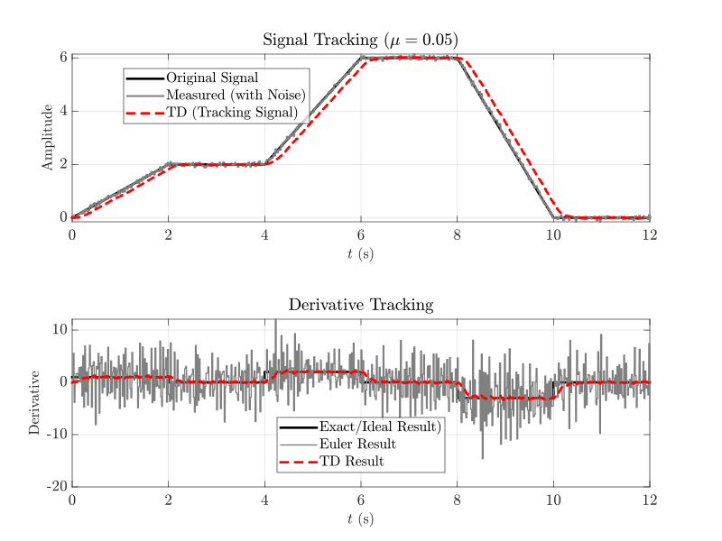

# 跟踪微分器（Tracking Differentiator）

## 原理
跟踪微分器（Tracking Differentiator, TD）是一种利用状态观测器的思想来实现微分信号获取的方法。TD的形式可以有多种，采用最广的是韩京清研究员提出的最速综合法，详见参考文献<span style="color:blue">[1]</span>。

具体表达式为
$$
    \begin{cases}
    x_1(k+1) = x_1(k) + h x_2(k), \\
    x_2(k+1) = x_2(k) + h\cdot\mathrm{fhan}\left(x_1(k),x_2(k),r,h_0\right),
    \end{cases}
$$
其中
$$
	\begin{cases}
	\mathrm{fsg}(\varkappa,d) = \dfrac{\mathrm{sign}(\varkappa + d) - \mathrm{sign}(\varkappa - d)}{2}, \\
	d = r h_0^2, \\
	a_0 = h_0x_2, \\
	y = x_1 + a_0, \\
	a_1 = \sqrt{d\left(d + 8 \left|y\right|\right)}, \\
	a_2 = a_0 + \dfrac{\mathrm{sign}(y)(a_1 - d)}{2}, \\
	a = (a_0 + y)\cdot\mathrm{fsg}(y,d) + a_2(1-\mathrm{fsg}(y,d)), \\
	\mathrm{fhan}(x_1,x_2,r,h_0) = -r\left(\dfrac{a}{d}\cdot\mathrm{fsg}(a,d)+\mathrm{sign}(a)(1-\mathrm{fsg}(a,d))\right).
	\end{cases}
$$


## 使用方法
1. 初始化
```matlab
% 初始化跟踪微分器
TD = TrckDiff(h,r,h0); % h:积分步长（采样周期）,r:跟踪速率,h0:滤波因子

% （可选）设置初值
TD.set_states(x_ini,x_diff_ini); % x_ini:跟踪信号初值,x_diff_ini:微分信号初值
```

2. 输入待微分的信号
```matlab
% 一般在循环中使用：
TD.update(x); % 更新跟踪微分器，x:待微分信号在当前时刻的取值
```

3. 获取微分结果
```matlab
% 一般在循环中使用：
x_diff = TD.output(); % x_diff:当前时刻的微分结果
```

4. （可选）设置参数
```matlab
% （可选）设置参数
TD.set_params(h,r,h0);  % h:积分步长（采样周期）,r:跟踪速率,h0:滤波因子
```

## 使用示例
- **示例代码参见<span style="color:blue">[TD_demo.m](https://github.com/ChhY-bit/ControlLib/TrackingDifferentiator/TD_demo.m)</span>**

- **结果分析：**
在含噪声的情况下，如果使用欧拉差分法计算微分信号：
$$
\bar{x}_2(k) \approx \dfrac{\bar{x}_1(k)-\bar{x}_1(k-1)}{T_s},
$$
其中$\bar{(\cdot)}$表示带噪声的测量值，$T_s$为采样周期。假设噪声信号为$n(k)$，则有$\bar{x}_1 = x_1(k) + n(k)$，进而有
$$
\bar{x}_2(k) \approx \overbrace{\dfrac{x_1(k)-x_1(k-1)}{T_s}}^{\text{微分真值}x_2(k)} + \overbrace{\dfrac{n(k)-n(k-1)}{T_s}}^{\text{噪声信号}s(k)},
$$
一般而言,n(k)是独立同分布的，即$n(k) \sim N(0,\sigma^2),\;\mathrm{Cov}(n(k),n(k-i)) = 0,\;\forall k,i\in \mathbb{Z}.$
因此有$$s(k)\sim N\left(0,\dfrac{2\sigma^2}{T_s^2}\right)$$\
<span style="color:red">可见噪声被放大了$\dfrac{2}{T_s^2}$倍。</span>当控制频率很高时（$T_s$很小），噪声放大倍数会变得十分巨大，使得微分信号被淹没在噪声中从而在实际控制中完全不可用。如图中的“Euler Result”所示。

而跟踪微分器（Tracking Differentiator）具有天然的滤波特性，可以有效地抑制噪声，如图中的“TD Result”所示。

## 参考文献

[1] 韩京清. 自抗扰控制技术[M]. 北京: 国防工业出版社, 2008: 97-110.